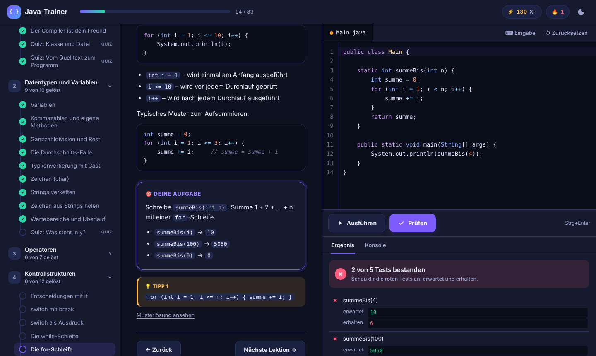

# Java-Trainer

Eine interaktive Lernumgebung im Browser zum Skript **„Sprache, Elemente, Strukturen, Klassen – Teil 1 OOP“** (Lektionen 1–13).

Kurze Lektionen, ein Code-Editor mit Syntaxhervorhebung, ein **Prüfen**-Knopf mit sofortigem Feedback, Quizfragen, Tipps, Fortschrittsanzeige, XP und eine Lernserie. Dein Code wird mit dem **echten Java-Compiler** deines JDK übersetzt und ausgeführt – genau wie in der Vorlesung.



---

## Starten

**Voraussetzung:** ein JDK ab Version 17, z. B. Eclipse Temurin (adoptium.net). Ob es installiert ist, zeigt `java -version` in der Kommandozeile.

| System | So startest du |
|---|---|
| Windows | Doppelklick auf `starten.bat` |
| macOS | Doppelklick auf `starten.command` (beim ersten Mal ggf. Rechtsklick → Öffnen) |
| Linux / Terminal | `./starten.sh` oder `java Trainer.java` im Ordner `java-lernprogramm` |

Klappt der Doppelklick nicht, öffne ein Terminal bzw. die Eingabeaufforderung, wechsle in den Ordner `java-lernprogramm` und gib `java Trainer.java` ein.

Der Browser öffnet sich automatisch mit `http://localhost:8080`. Falls nicht, kopiere die Adresse aus dem Konsolenfenster. Zum Beenden das Konsolenfenster schließen oder `Strg+C` drücken.

---

## So funktioniert es

1. **Lektion lesen** – links stehen Erklärung, Beispiel und deine Aufgabe.
2. **Code schreiben** – rechts im Editor (die Klasse heißt immer `Main`).
3. **Ausführen** startet nur dein Programm. Die Ausgabe erscheint im Reiter „Konsole“.
4. **Prüfen** (`Strg+Enter`) testet deine Lösung. Du siehst jeden Test mit **erwartet** und **erhalten**. Compilerfehler werden mit Zeilennummer angezeigt; ein Klick springt zur Zeile.
5. Geschafft? Dann gibt es XP und es geht weiter zur nächsten Lektion.

**Hilfe, wenn du feststeckst:** 💡 Tipps lassen sich Schritt für Schritt aufdecken. Die Musterlösung kannst du jederzeit ansehen – vor dem Bestehen gibt es dann aber nur die halben XP.

**Fortschritt** (gelöste Lektionen, dein Code, XP, Lernserie) wird automatisch in `fortschritt.json` gespeichert. Mit „↺ Zurücksetzen“ holst du die Vorlage einer Lektion zurück.

**Programme mit Eingabe:** Über „⌨ Eingabe“ trägst du Tastatureingaben für `Scanner` ein – eine pro Zeile.

---

## Inhalt: 83 Lektionen in 12 Kapiteln

| Kapitel | Thema | Skript | Lektionen |
|---|---|---|---|
| 1 | Erste Schritte | Lektion 3–5 | 5 |
| 2 | Datentypen und Variablen | Lektion 7 | 10 |
| 3 | Operatoren | Lektion 7 | 7 |
| 4 | Kontrollstrukturen | Lektion 7 | 12 |
| 5 | Arrays und Strings | S. 13–15, 22, 35 | 8 |
| 6 | Klassen und Objekte | Lektion 8 | 6 |
| 7 | Datenkapselung und Konstruktoren | Lektion 9 | 7 |
| 8 | Vererbung | Lektion 10 | 7 |
| 9 | Klassenvariablen und Klassenmethoden | Lektion 11 | 4 |
| 10 | Abstrakte Klassen und Schnittstellen | Lektion 12 | 6 |
| 11 | Wiederholung und Klausurtraining | Lektion 1, 2, 6, 13 | 8 |
| 12 | Abschlussprojekt: Kaderverwaltung | alles | 3 |

Davon sind 60 Programmieraufgaben, 22 Quizfragen und eine Praxis-Anleitung (eigene Pakete mit `javac`, Musterlösung in `extras/pakete`).


---

## Hinweise zum Skript

An drei Stellen ist das Skript vereinfacht. Die Lektionen weisen darauf hin; alle drei Punkte sind mit JDK 21 ausprobiert:

1. **Standardkonstruktor (S. 25/30):** Java erzeugt ihn **nur**, wenn eine Klasse keinen eigenen Konstruktor hat (Java Language Specification §8.8.9). → Lektion 7.7
2. **Statische Methoden (S. 42):** Sie sind nicht „implizit final“ – eine Subklasse darf sie verdecken, solange sie nicht ausdrücklich `final` sind (JLS §8.4.3.3, §8.4.8.2).
3. **Interfaces (S. 40):** Seit Java 8 dürfen sie auch `default`- und `static`-Methoden mit Rumpf enthalten (JLS §9.4). → Lektion 10.6

Für die Klausur gilt, was in eurer Vorlesung behandelt wurde. Die Lektionen rechnen mit `Math.PI` statt `3.14`.

---

## Technisches

- **Nur lokal:** Der Trainer ist ausschließlich unter `localhost` erreichbar. Anfragen anderer Webseiten werden abgewiesen (Prüfung von Host, Herkunft und einem zufälligen Sitzungsschlüssel).
- **Ausführung:** Jeder Lauf startet in einem eigenen Java-Prozess mit 5 Sekunden Zeitlimit und 256 MB Speicher. Endlosschleifen werden beendet.
- **Kein Internet nötig:** Der Editor (CodeMirror 5.65.16, MIT-Lizenz) liegt in `web/vendor/`.
- **Compilermeldungen** erscheinen auf Deutsch, wenn dein JDK eine deutsche Übersetzung mitbringt (bei JDK 21 der Fall), sonst auf Englisch.

### Eigene Lektionen schreiben

Jede Lektion ist eine Textdatei in `kurs/` (Name `KK-NN-titel.txt`, `KK` = Kapitelnummer aus `kurs/kapitel.txt`) mit Abschnitten:

```
=== titel
=== erklaerung      (Markdown)
=== aufgabe         (Markdown)
=== vorlage         (Startcode, Klasse Main)
=== pruefung        (Java-Anweisungen mit Check.gleich, Check.ausgabe, Check.quelltextEnthaelt …)
=== loesung
=== tipp            (beliebig oft)
```

Quizfragen haben `=== typ` → `quiz`, dazu `=== frage`, `=== optionen` (richtige Antwort mit `+ `, falsche mit `- `) und `=== nachher`. Die Prüfwerkzeuge stehen in `kurs/_pruefer/Check.java`.

Selbsttest aller Lektionen – jede Vorlage muss kompilieren und darf noch nicht bestehen, jede Musterlösung muss alle Tests bestehen:

```
java Trainer.java --selbsttest
```
