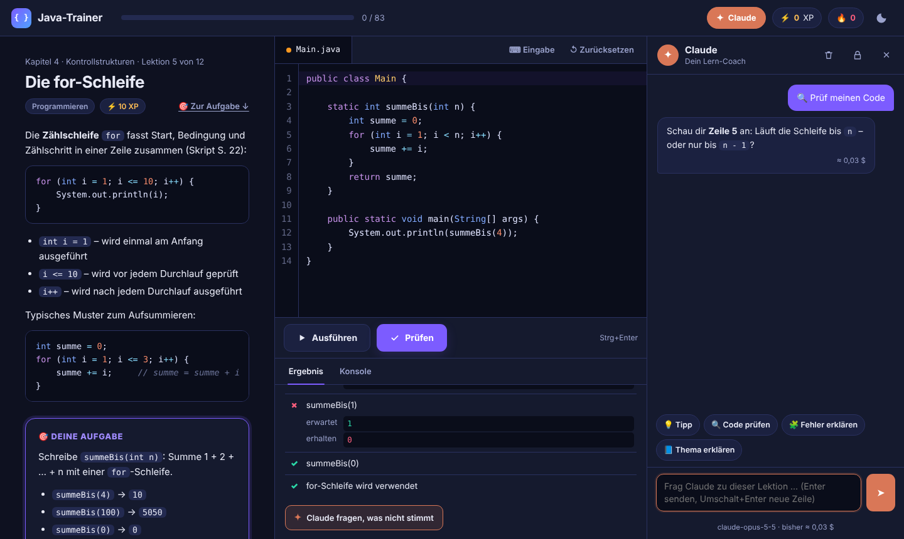

# Java-Trainer

Eine Lern-App für den Mac zum Skript **„Sprache, Elemente, Strukturen, Klassen – Teil 1 OOP“** (Lektionen 1–13) – mit **Claude als eingebautem Lern-Coach**.

Kurze Lektionen, ein Code-Editor mit Syntaxhervorhebung, ein **Prüfen**-Knopf mit sofortigem Feedback, Quizfragen, Tipps, Fortschritt, XP und eine Lernserie. Dein Code wird mit dem **echten Java-Compiler** deines JDK übersetzt und ausgeführt – genau wie in der Vorlesung. Wenn du feststeckst, gibt dir Claude Denkanstöße, kontrolliert deinen Code und erklärt Fehlermeldungen.



*Bildschirmfoto mit einer Beispielantwort aus einem Testaufbau – echte Antworten formuliert Claude jeweils selbst.*

---

## Als Mac-App installieren (empfohlen)

**Voraussetzungen:** macOS 13 oder neuer, Xcode (oder nur die Command Line Tools: `xcode-select --install`) und ein JDK ab Version 17, z. B. Eclipse Temurin von adoptium.net.

Im Terminal, im Ordner `java-lernprogramm`:

```
./mac/app-bauen.sh
```

Das Skript lädt einmalig das Anthropic-Java-SDK (für Claude, mit Prüfsummen-Kontrolle), übersetzt die App und legt **Java-Trainer.app** in den Ordner **„Programme“**. Danach startest du sie wie jede andere App – aus „Programme“, dem Launchpad oder dem Dock. Nach Änderungen an den Lektionen das Skript einfach erneut ausführen.

Dein Fortschritt liegt in `~/Library/Application Support/Java-Trainer/`, der API-Schlüssel für Claude im **macOS-Schlüsselbund**. Nach einem Neubau der App fragt macOS beim ersten Start eventuell, ob Java-Trainer auf den Schlüsselbund-Eintrag zugreifen darf – dann „Immer erlauben“ wählen.

### Alternativ: im Browser

Ohne App geht es auch im Browser: `./starten.sh` (macOS/Linux), Doppelklick auf `starten.command` (macOS) oder `starten.bat` (Windows). Der Trainer öffnet sich dann unter `http://localhost:8080`. Der Fortschritt liegt in diesem Fall in `fortschritt.json`, der API-Schlüssel in `~/.javatrainer/` (nur für dich lesbar).

---

## Claude als Lern-Coach

Oben rechts öffnet **✦ Claude** das Coach-Fenster. Claude kennt dabei die aktuelle Lektion, deinen Code und das **echte Prüfergebnis** (Compilermeldungen und Tests) – Aussagen über deinen Code beruhen also nicht auf Raten.

- **💡 Tipp** – ein kleiner Denkanstoß für den nächsten Schritt
- **🔍 Code prüfen** – was stimmt, was nicht und warum; nach dem Bestehen ein kurzes Code-Review
- **🧩 Fehler erklären** – Compiler- oder Testmeldung in einfachen Worten
- **📘 Thema erklären** – das Thema noch einmal anders, mit eigenem Beispiel
- oder einfach eine eigene Frage

Claude ist angewiesen, keine fertigen Lösungen vorzusagen, außer du bittest ausdrücklich darum. Nach fehlgeschlagenen Prüfungen und falschen Quizantworten erscheint außerdem ein Knopf „Claude fragen“.

**Einrichten:** Claude braucht einen API-Schlüssel von Anthropic. Lege ihn in der Claude Console unter *API Keys* an (platform.claude.com/settings/keys) und füge ihn im Coach-Fenster ein. Die App prüft den Schlüssel mit einer kostenlosen Abfrage, bevor sie ihn speichert.

**Kosten:** Die Nutzung wird über dein Anthropic-Konto abgerechnet. Die App verwendet `claude-opus-5-5`, laut Anthropic-Preisliste 4 $ je 1 Mio. Eingabe-Tokens und 20 $ je 1 Mio. Ausgabe-Tokens. Beispielrechnung für eine Frage mit 2.800 Eingabe- und 950 Ausgabe-Tokens: 2.800 × 4 / 1.000.000 + 950 × 20 / 1.000.000 ≈ 0,03 $. Nach jeder Antwort zeigt die App die ungefähren Kosten an, unten im Coach-Fenster die Summe. Maßgeblich ist die Abrechnung in der Claude Console.

**Was an Anthropic gesendet wird:** Lektionstext, dein Code, das Prüfergebnis, die Musterlösung (als Hintergrund für Claude) und deine Fragen samt bisherigem Gesprächsverlauf zu dieser Lektion. Sonst nichts.

---

## So funktioniert es

1. **Lektion lesen** – links stehen Erklärung, Beispiel und deine Aufgabe.
2. **Code schreiben** – rechts im Editor (die Klasse heißt immer `Main`).
3. **Ausführen** startet nur dein Programm. Die Ausgabe erscheint im Reiter „Konsole“.
4. **Prüfen** (`Strg+Enter`) testet deine Lösung. Du siehst jeden Test mit **erwartet** und **erhalten**. Compilerfehler werden mit Zeilennummer angezeigt; ein Klick springt zur Zeile.
5. Geschafft? Dann gibt es XP und es geht weiter zur nächsten Lektion.

**Hilfe, wenn du feststeckst:** Frag Claude, oder decke die 💡 Tipps der Lektion Schritt für Schritt auf. Die Musterlösung kannst du jederzeit ansehen – vor dem Bestehen gibt es dann aber nur die halben XP.

**Fortschritt** (gelöste Lektionen, dein Code, XP, Lernserie, Gespräche mit Claude) wird automatisch gespeichert. Mit „↺ Zurücksetzen“ holst du die Vorlage einer Lektion zurück.

**Programme mit Eingabe:** Über „⌨ Eingabe“ trägst du Tastatureingaben für `Scanner` ein – eine pro Zeile.

---

## Inhalt: 83 Lektionen in 12 Kapiteln

| Kapitel | Thema | Skript | Lektionen |
|---|---|---|---|
| 1 | Erste Schritte | Lektion 3–5 | 5 |
| 2 | Datentypen und Variablen | Lektion 7 | 10 |
| 3 | Operatoren | Lektion 7 | 7 |
| 4 | Kontrollstrukturen | Lektion 7 | 12 |
| 5 | Arrays und Strings | S. 13–15, 22, 35 | 8 |
| 6 | Klassen und Objekte | Lektion 8 | 6 |
| 7 | Datenkapselung und Konstruktoren | Lektion 9 | 7 |
| 8 | Vererbung | Lektion 10 | 7 |
| 9 | Klassenvariablen und Klassenmethoden | Lektion 11 | 4 |
| 10 | Abstrakte Klassen und Schnittstellen | Lektion 12 | 6 |
| 11 | Wiederholung und Klausurtraining | Lektion 1, 2, 6, 13 | 8 |
| 12 | Abschlussprojekt: Kaderverwaltung | alles | 3 |

Davon sind 60 Programmieraufgaben, 22 Quizfragen und eine Praxis-Anleitung (eigene Pakete mit `javac`, Musterlösung in `extras/pakete`).


---

## Hinweise zum Skript

An drei Stellen ist das Skript vereinfacht. Die Lektionen weisen darauf hin; alle drei Punkte sind mit JDK 21 ausprobiert:

1. **Standardkonstruktor (S. 25/30):** Java erzeugt ihn **nur**, wenn eine Klasse keinen eigenen Konstruktor hat (Java Language Specification §8.8.9). → Lektion 7.7
2. **Statische Methoden (S. 42):** Sie sind nicht „implizit final“ – eine Subklasse darf sie verdecken, solange sie nicht ausdrücklich `final` sind (JLS §8.4.3.3, §8.4.8.2).
3. **Interfaces (S. 40):** Seit Java 8 dürfen sie auch `default`- und `static`-Methoden mit Rumpf enthalten (JLS §9.4). → Lektion 10.6

Für die Klausur gilt, was in eurer Vorlesung behandelt wurde. Die Lektionen rechnen mit `Math.PI` statt `3.14`.

---

## Technisches

- **Nur lokal:** Der Trainer ist ausschließlich unter `localhost` erreichbar. Anfragen anderer Webseiten werden abgewiesen (Prüfung von Host, Herkunft und einem zufälligen Sitzungsschlüssel).
- **Ausführung:** Jeder Lauf startet in einem eigenen Java-Prozess mit 5 Sekunden Zeitlimit und 256 MB Speicher. Endlosschleifen werden beendet.
- **Internet** braucht nur Claude und der einmalige Download des Anthropic-Java-SDK (Version 2.70.0 von Maven Central, Liste und SHA-256-Prüfsummen in `werkzeuge/abhaengigkeiten.txt`). Der Editor (CodeMirror 5.65.16, MIT-Lizenz) liegt in `web/vendor/`.
- **Mac-App:** `mac/JavaTrainerApp.swift` ist eine schlanke SwiftUI-Hülle. Sie startet den vorübersetzten Java-Teil mit `--app` und zeigt die Oberfläche in einem WebKit-Fenster. Beendest du die App, beendet sich auch der Java-Teil.
- **Compilermeldungen** erscheinen auf Deutsch, wenn dein JDK eine deutsche Übersetzung mitbringt (bei JDK 21 der Fall), sonst auf Englisch.

### Eigene Lektionen schreiben

Jede Lektion ist eine Textdatei in `kurs/` (Name `KK-NN-titel.txt`, `KK` = Kapitelnummer aus `kurs/kapitel.txt`) mit Abschnitten:

```
=== titel
=== erklaerung      (Markdown)
=== aufgabe         (Markdown)
=== vorlage         (Startcode, Klasse Main)
=== pruefung        (Java-Anweisungen mit Check.gleich, Check.ausgabe, Check.quelltextEnthaelt …)
=== loesung
=== tipp            (beliebig oft)
```

Quizfragen haben `=== typ` → `quiz`, dazu `=== frage`, `=== optionen` (richtige Antwort mit `+ `, falsche mit `- `) und `=== nachher`. Die Prüfwerkzeuge stehen in `kurs/_pruefer/Check.java`.

Selbsttest aller Lektionen – jede Vorlage muss kompilieren und darf noch nicht bestehen, jede Musterlösung muss alle Tests bestehen:

```
./werkzeuge/sdk-laden.sh
java -cp "lib/*" Trainer.java --selbsttest
```
